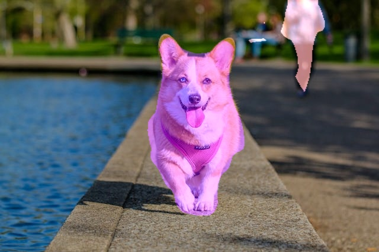
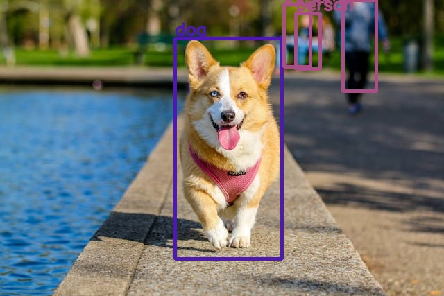
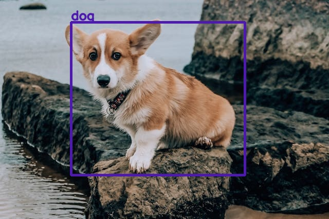

# DINOv3 Stack

A repository to apply DINOv3 models for different downstream tasks: ***image classification, semantic segmentation, object detection***.

## License

It is a mix of MIT and the official DINOv3 License. All the codebase in this repository are completely open and can be used for research, education, and commercial purposes freely. The models trained will be adhering to the DINOv3 License which is included with the repository.

## Prerequisites

### Download Weights

* Download the pretrained backbones weights by following the instructions from the official [DINOv3 repository](https://github.com/facebookresearch/dinov3). 

* ```
  git clone https://github.com/sovit-123/dinov3_stack.git
  ```

* Prepare a `.env` file in the cloned project directory with the following content.

  ```bash
  # Should be absolute path to DINOv3 cloned repository.
  DINOv3_REPO="/path/to/cloned/dinov3"
  
  # Should be absolute path to DINOv3 weights.
  DINOv3_WEIGHTS="/path/to/downloaded/dinov3/weights"
  ```

​	The above two paths will be picked up the training and inference scripts while initializing the models.

Cloning of the official DINOv3 repository is necessary and the cloned path should be modified as mentioned above in the `.env` file 

* Install the project requirements.

```
pip install -r requirements.txt
```

## Updates

* August 24, 2025: *First commit*. Contains training and inference scripts and *image classification* and *semantic segmentation*.
* September 21, 2025: Object detection training and inference code added.

## Image Classification

Check `src/img_cls` folder for all the coding details.

The `train_classifier.py` in the project root directory is the executable script to start the training process.

For training, make sure that the `--model-name` argument matches correctly with the `--weights` argument.

[Check this](https://github.com/facebookresearch/dinov3?tab=readme-ov-file#pretrained-backbones-via-pytorch-hub) to know all the `--model-name` values that can be passed (e.g. `dinov3_vits16`, etc.)..

* Steps to train:

```
python train_classifier.py --train-dir path/to/directory/with/training/class/folder --valid-dir path/to/directory/with/validation/class/folder --epochs <num_epochs> --weights <name/of/dinov3/weights.pth> --model-name <model_name>
```

```
python train_classifier.py --help
usage: train_classifier.py [-h] [-e EPOCHS] [-lr LEARNING_RATE] [-b BATCH_SIZE] [--save-name SAVE_NAME] [--fine-tune] [--out-dir OUT_DIR] [--scheduler SCHEDULER [SCHEDULER ...]]
                           --train-dir TRAIN_DIR --valid-dir VALID_DIR --weights WEIGHTS --repo-dir REPO_DIR [--model-name MODEL_NAME]

options:
  -h, --help            show this help message and exit
  -e EPOCHS, --epochs EPOCHS
                        Number of epochs to train our network for
  -lr LEARNING_RATE, --learning-rate LEARNING_RATE
                        Learning rate for training the model
  -b BATCH_SIZE, --batch-size BATCH_SIZE
  --save-name SAVE_NAME
                        file name of the final model to save
  --fine-tune           whether to fine-tune the model or train the classifier layer only
  --out-dir OUT_DIR     output sub-directory path inside the `outputs` directory
  --scheduler SCHEDULER [SCHEDULER ...]
                        number of epochs after which learning rate scheduler is applied
  --train-dir TRAIN_DIR
                        path to the training directory containing class folders in PyTorch ImageFolder format
  --valid-dir VALID_DIR
                        path to the validation directory containing class folders in PyTorch ImageFolder format
  --weights WEIGHTS     path to the pretrained backbone weights
  --repo-dir REPO_DIR   path to the cloned DINOv3 repository
  --model-name MODEL_NAME
                        name of the model, check: https://github.com/facebookresearch/dinov3?tab=readme-ov-file#pretrained-backbones-via-pytorch-hub
```

* Step to run image inference:

The YAML configuration file can be put in `classification_configs` directory which contains the class names. For example, if you train a model on a leaf disease classification dataset, then you can create `classification_configs/leaf_disease.yaml` with the following content.

```
CLASS_NAMES: ['Healthy', 'Powdery', 'Rust']
```

```
python infer_classifier.py --weights <path/to/trained/weights.pth> --input <path/to/image/directory> --config <path/to/config.yaml> --repo-dir <path/to/cloned/dinov3> --model-name <model_name>
```

## Semantic Segmentation

Check `src/img_seg` for all coding details.

Check the `segmentation_configs` directory to know more about setting up the configuration YAML files.

Check [this dataset on Kaggle](https://www.kaggle.com/datasets/sovitrath/voc-2012-segmentation-data) to know how the images and masks are structured.

[Check this](https://github.com/facebookresearch/dinov3?tab=readme-ov-file#pretrained-backbones-via-pytorch-hub) to know all the `--model-name` values that can be passed (e.g. `dinov3_vits16`, etc.).

* Training example command:

```
python train_segmentation.py --train-images voc_2012_segmentation_data/train_images --train-masks voc_2012_segmentation_data/train_labels --valid-images voc_2012_segmentation_data/valid_images --valid-masks voc_2012_segmentation_data/valid_labels --config segmentation_configs/voc.yaml --weights <name/of/dinov3/weights.pth> --model-name <model_name> --epochs 50 --out-dir voc_seg --imgsz 640 640 --batch 12
```

​	Example command with specific model:

```
python train_segmentation.py --train-images voc_2012_segmentation_data/train_images --train-masks voc_2012_segmentation_data/train_labels --valid-images voc_2012_segmentation_data/valid_images --valid-masks voc_2012_segmentation_data/valid_labels --config segmentation_configs/voc.yaml dinov3_convnext_tiny_pretrain_lvd1689m-21b726bb.pth --model-name dinov3_convnext_tiny --epochs 50 --out-dir voc_seg --imgsz 640 640 --batch 12
```

* Image inference using fine-tuned model (use the same configuration YAML file as used during training for the same weights. For example for the above training, we should use `voc.yaml` during inference also.):

```
python infer_seg_image.py --input <directory/with/images> --model <path/to/best_iou_weights.pth> --config <dataset/config.yaml> --model-name <model_name> --imgsz 640 640
```

* Video inference using fine-tuned model (use the same configuration YAML file as used during training for the same weights. For example for the above training, we should use `voc.yaml` during inference also.):

```
python infer_seg_video.py --input <path/to/video.mp4> --model <path.to/best_iou_weights.pth> --config <dataset/config.yaml> --model-name <model_name> --imgsz 640 640
```

### Results

|  |  |
| ----------------------------------- | ----------------------------------- |

## Object Detection

Check `src/detection` for all coding details.

Check the `detection_configs` directory to know more about setting up the configuration YAML files.

Check [this dataset on Kaggle](https://www.kaggle.com/datasets/sovitrath/voc-07-12) to know how the images and masks are structured.

*New:* the detection configuration files accept an `ANNOT_FORMAT` key that controls how bounding boxes are read. Set it to `pascal_voc` (default) for XML annotations or to `yolo_txt` when working with YOLO formatted `.txt` label files. Point the `TRAIN_ANNOT` and `VALID_ANNOT` paths to the corresponding annotation directories.

[Check this](https://github.com/facebookresearch/dinov3?tab=readme-ov-file#pretrained-backbones-via-pytorch-hub) to know all the `--model-name` values that can be passed (e.g. `dinov3_vits16`, etc.).

The training pipeline supports building detection head with SSD and RetinaNet. RetinaNet is default is gives much better results.

* Training example command:

```
python train_detection.py --weight dinov3_convnext_tiny_pretrain_lvd1689m-21b726bb.pth --model-name dinov3_convnext_tiny --imgsz 640 640 --lr 0.0001  --epochs 30 --workers 8 --batch 8 --config detection_configs/voc.yaml --out-dir trial_runs --fine-tune
```

```
python train_detection.py --help
usage: train_detection.py [-h] [--epochs EPOCHS] [--lr LR] [--batch BATCH] [--imgsz IMGSZ [IMGSZ ...]] [--scheduler] [--scheduler-epochs SCHEDULER_EPOCHS [SCHEDULER_EPOCHS ...]]
                          [--out-dir OUT_DIR] --weights WEIGHTS [--repo-dir REPO_DIR] [--model-name MODEL_NAME] [--fine-tune] [--feautre-extractor {last,multi}] [--workers WORKERS]
                          [--optimizer {SGD,AdamW}] [--config CONFIG] [--head {ssd,retinanet}]

options:
  -h, --help            show this help message and exit
  --epochs EPOCHS       number of epochs to train for
  --lr LR               learning rate for optimizer
  --batch BATCH         batch size for data loader
  --imgsz IMGSZ [IMGSZ ...]
                        width, height
  --scheduler
  --scheduler-epochs SCHEDULER_EPOCHS [SCHEDULER_EPOCHS ...]
  --out-dir OUT_DIR     output sub-directory path inside the `outputs` directory
  --weights WEIGHTS     path to the pretrained backbone weights
  --repo-dir REPO_DIR   path to the cloned DINOv3 repository
  --model-name MODEL_NAME
                        name of the model, check: https://github.com/facebookresearch/dinov3?tab=readme-ov-file#pretrained-backbones-via-pytorch-hub
  --fine-tune
  --feautre-extractor {last,multi}
                        whether to use layer or multiple layers as features
  --workers WORKERS     number of parllel workers for the data loader
  --optimizer {SGD,AdamW}
  --config CONFIG       path to the configuration yaml file in detection_configs folder
  --head {ssd,retinanet}
                        whether to build with SSD or RetinaNet detection head
```

* Image inference using fine-tuned model (use the same configuration YAML file as used during training for the same weights. For example for the above training, we should use `voc.yaml` during inference also.):

```
python infer_det_image.py --model outputs/retinanet_trial/best_model.pth --model-name dinov3_convnext_tiny --input input/inference_data/images --config detection_configs/voc.yaml
```

* Video inference using fine-tuned model (use the same configuration YAML file as used during training for the same weights. For example for the above training, we should use `voc.yaml` during inference also.):

```
python infer_det_video.py --model outputs/retinanet_trial/best_model.pth --model-name dinov3_convnext_tiny --input input/inference_data/videos/video_1.mp4 --config detection_configs/voc.yaml
```

### Results

|  |  |
| ----------------------------------- | ----------------------------------- |

